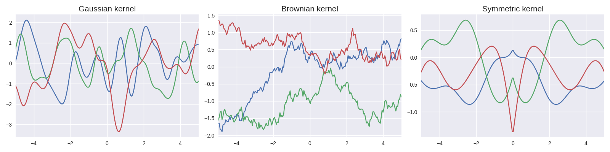

# Gaussian process generator

This repository contains the source code of a simple <a href=https://en.wikipedia.org/wiki/Gaussian_process>gaussian process</a> generator made in Python (assuming mean zero).

The file `gaussian_process.py` contains the `GaussianProcess` class that itself contains all the functions required to generate a gaussian process. The only package required for this is `numpy`.

The file `example.py` provides a few examples of gaussian process generation and plotting. This file requires `matplotlib` in addition of `numpy`.

Multiple kernels are available:
 - Gaussian (squared-exponential)
 - Brownian
 - Ornstein-Uhlenbeck
 - Periodic
 - Symmetric
Additional kernels can be easily implemented.

Here is an example with three different kernels:

    

Have fun with this gaussian process generator !
